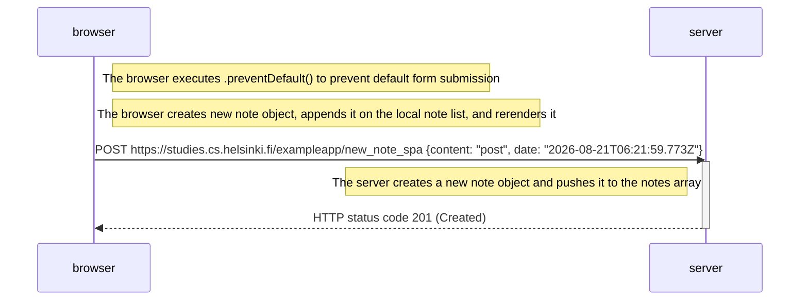

```mermaid
sequenceDiagram
    participant browser
    participant server

    

    Note right of browser: The browser executes .preventDefault() to prevent default form submission

    Note right of browser: The browser creates new note object, appends it on the local note list, and rerenders it

    browser->>server: POST https://studies.cs.helsinki.fi/exampleapp/new_note_spa {content: "post", date: "2026-08-21T06:21:59.773Z"}

    activate server

    Note left of server: The server creates a new note object and pushes it to the notes array

    server-->>browser: HTTP status code 201 (Created)
    deactivate server
```